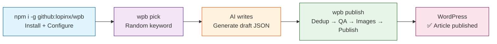
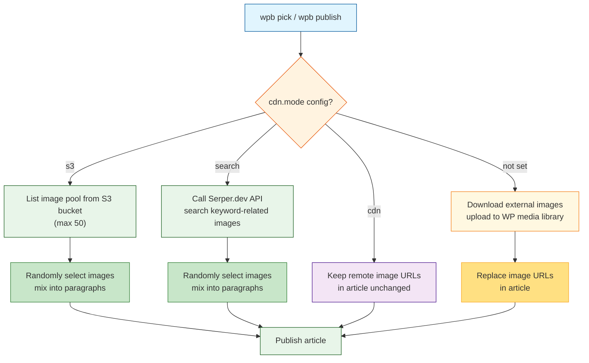
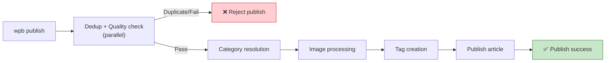

# WordPress AI Publisher (wpb)

> Cross-platform WordPress publishing CLI — single command: random keyword → AI writes → mix images → publish via WP REST API

<div align="center">

[](https://nodejs.org)
[](LICENSE)
[](#)

</div>

---

## 🎯 Overview

**wpb** is a single-file Node.js CLI tool designed for **AI-assisted WordPress content publishing workflows**. It helps SEO operators or content teams pick a topic from a keyword pool, combine product data and writing guidelines, assist AI in generating article drafts, then automatically handle image mixing, quality checks, and duplicate detection before publishing to WordPress.

**Highlights**:

- Compatible with **11 AI tools** (Claude Code, OpenAI Codex, Gemini CLI, Cursor, GitHub Copilot, OpenCode, Hermes, Antigravity CLI, OpenClaw, XiaoU, ZCode)
- Supports **Excel (XLSX/XLS), CSV, TXT, Google Sheets URLs** and other data sources
- Fully compatible with files exported from **Google Search Console, Bing Webmaster Tools, Baidu Webmaster**
- Four image modes: S3 pool mixing / Serper.dev search / CDN direct / auto-upload to media library
- Automatic duplicate detection and quality check before publishing (word count, paragraphs, H3, title, excerpt, tags, dead links, etc.)

### Core Workflow



---

## 🚀 Quick Start

```bash
npm i -g github:lopinx/wpb
```

---

## 💻 CLI Commands

| Command | Description | Example |
|---------|-------------|---------|
| `wpb pick` | Randomly pick a keyword + output full context (JSON) | `wpb pick` |
| `wpb fetch <url>` | Fetch a published article for rewriting/updating | `wpb fetch https://example.com/old-post` |
| `wpb publish <file>` | Read draft and publish (update path when draft contains postId) | `wpb publish ~/.wpb/_draft.json` |

### npm scripts

```bash
npm test           # Run the self-test suite (280/280 passing)
```

---

## 📋 Full Usage Steps

### Step 1: Install

```bash
npm i -g github:lopinx/wpb
```

After installation, run `wpb pick` directly. On first run it automatically:
1. **Generates default config**: Creates `~/.wpb/setting.toml` (editable afterwards)
2. **Copies data files**: Copies sample keywords, products, prompts to `~/.wpb/data/`

Then edit `~/.wpb/setting.toml`, fill in your WordPress site info (URL, username, Application Password), and run `wpb pick` again.

> **Optional**: To detect locally installed AI CLI tools (Claude Code, Gemini CLI, and 9 others) and create command files for them, run `wpb install`. This command performs AI CLI detection + command file generation on top of the base configuration.

> **Uninstall**:
> ```bash
> npm uninstall -g @lopinx/wpb
> ```
> For a complete cleanup, also delete the user data directory: `rm -rf ~/.wpb` (Windows PowerShell: `Remove-Item -Recurse -Force $HOME\.wpb`).

### Step 2: Pick a Keyword

```bash
wpb pick
```

The tool randomly selects a row from the file configured in `keywords` and outputs JSON like:

```json
{
  "site": {
    "name": "myblog",
    "url": "https://example.com/wp-json/wp/v2",
    "categories": [8603, "Disposable Vape"],
    "images": { "gl": "pl", "hl": "pl", "tbs": "qdr:w" }
  },
  "keyword": "best disposable vape 2024",
  "keywordRow": ["best disposable vape 2024", "12000", "0.45"],
  "products": [["Elf Bar BC5000", "Elf Bar", "5000", "24.99", "5000 puffs disposable vape"]],
  "prompts": "# Writing instructions\n\n...",
  "extensions": "# Extended knowledge\n\n..."
}
```

Pass this JSON to an AI tool (Claude Code, Gemini CLI, etc.) and have it write an article based on the keyword, product info, writing instructions, and extended knowledge.

### Step 3: Draft the Article

Save the AI-generated article as a draft JSON file, then run the publish command:

```bash
wpb publish <draft-file-path>
```

Draft format:

```json
{
  "title": "Article Title",
  "excerpt": "Article excerpt",
  "content": "<p>First paragraph...</p><h3>Subtitle one</h3><p>...</p><h3>Subtitle two</h3><p>...</p><h3>Subtitle three</h3><p>...</p>",
  "tags": ["tag1", "tag2", "tag3"]
}
```

**Field descriptions**:

| Field | Type | Required | Description |
|-------|------|----------|-------------|
| `title` | string | ✅ | Article title (≥10 characters) |
| `excerpt` | string | ✅ | Article excerpt (≥50 characters) |
| `content` | string | ✅ | HTML article body, must include `<p>` paragraphs and `<h3>` subheadings |
| `tags` | string[] | ❌ | Tag array (3-10, used for quality check) |
| `postId` | number | ❌ | Existing article ID (required for updates, output by `wpb fetch`) |
| `site` | string | ❌ | Site name (required for multi-site updates, output by `wpb fetch`) |

### Step 4: Publish the Article

```bash
wpb publish <draft-file-path>
```

The publish flow automatically performs these steps:

1. **Duplicate check + quality check**: Runs in parallel — searches WordPress for articles with the same title (rejects if duplicate, excludes self when updating), and validates word count, paragraphs, H3, title length, excerpt length, tag count, dead links (rejects if not passed)
2. **Category resolution**: Resolves configured categories (numeric IDs or names) to WordPress category IDs, auto-creates missing categories
3. **Image processing**: Processes images based on configured `cdn.mode` (see "Image Modes" below)
4. **Tag creation**: Auto-creates missing tags in WordPress
5. **Publish article**: Creates a published-status article via WordPress REST API (update path when draft contains `postId`)

### Step 5: Update an Existing Article

When you need to rewrite or optimize a published article on your site:

```bash
# 1. Fetch the original (accepts article URL only, not ID)
wpb fetch https://example.com/old-post
```

`wpb fetch` auto-matches the configured site by URL domain (not random in multi-site scenarios) and outputs JSON containing `postId`, `site`, `title`, `excerpt`, `content`, `tags`, `categories`.

```bash
# 2. AI rewrites based on the original, save draft JSON (keep postId and site fields)
# 3. Publish (auto-detects postId and takes the update path)
wpb publish <draft-file-path>
```

> **Multi-site safety**: The update path never picks a site at random. When the draft contains a `site` field, it matches the configured site by name; with no `site` and a single-site config, it falls back to that site; with no `site` and a multi-site config, it refuses to execute and prompts you to run `wpb fetch` first for full context.

---

## 📁 Project File Structure

```
wpb/
├── README.md                          # Project docs (Chinese)
├── README.en.md                       # Project docs (English)
├── AGENTS.md                          # AI agent guidelines
├── package.json                       # Project manifest (npm global install entry)
├── skills/
│   └── wpb/
│       ├── SKILL.md                   # AI tool command file template
│       ├── references/
│       │   └── data/                  # Sample data files (copied to ~/.wpb/data/ on install)
│       │       ├── keywords.csv       # Keyword pool
│       │       ├── products.csv       # Product info
│       │       ├── prompts.md         # Writing instructions
│       │       └── extensions/
│       │           └── wiedza.md      # Extended knowledge
│       └── scripts/
│           ├── wpb.mjs                # Core single file (all logic, includes initConfig first-run setup)
│           └── __TEST__/
│               └── selftest.mjs       # Self-test suite (280/280 passing)
```

**Runtime-generated**:

```
~/.wpb/                              # User config directory
├── setting.toml                     # WordPress config (auto-generated on npm install)
└── data/                            # Data files (auto-copied on npm install)
    ├── keywords.csv
    ├── products.csv
    ├── prompts.md
    └── extensions/
        └── wiedza.md
```

---

## 🔧 Configuration `~/.wpb/setting.toml`

Running `npm i -g github:lopinx/wpb` auto-generates the default config. Before use, ensure you have:

- Node.js ≥ 18.0
- A WordPress site (requires REST API access and an Application Password)
- (Optional) An S3-compatible bucket, or a Serper.dev API key

Config file example:

```toml
# ~/.wpb/setting.toml
# Each [site.<slug>] represents a WordPress site
# wpb pick randomly selects one of these sites

[site.myblog]
# ── Site basics (required) ──
name       = "My Blog"                                      # Display name (optional, falls back to [site.<slug>] slug)
url        = "https://example.com/wp-json/wp/v2"            # WordPress REST API endpoint
user       = "admin"                                        # WordPress username
pass       = "xxxx xxxx xxxx xxxx"                          # WP Application Password (min 10 chars)
categories = [1, "news", "vape"]                            # Publish categories (numeric IDs or names)
keywords   = ["data/keywords.csv"]                          # Keyword files (multiple allowed, randomly merged)
products   = "data/products.csv"                            # Product info file (optional, multiple allowed, random pick)
prompts    = "data/prompts.md"                              # Writing instructions file (optional, Markdown, multiple allowed)
extensions = ["data/extensions/wiedza.md"]                  # Extended knowledge files (optional, multiple allowed)

# ── Image processing mode (choose one, see details below) ──
# mode = "s3"      → Pick from S3 image pool and mix into article (recommended, full image control)
# mode = "search"  → Call Serper.dev API to search images and mix in
# mode = "cdn"     → Keep remote image URLs in the article unchanged
# No [site.myblog.cdn] → Auto-download external images and upload to WP media library

[site.myblog.cdn]
mode          = "s3"
bucket        = "my-bucket"                                 # S3 bucket name
region        = "us-east-1"                                # AWS region, e.g. us-east-1 / cn-north-1
accessKeyId   = "AKIA..."                                   # S3 Access Key ID
secretAccessKey = "..."                                     # S3 Secret Access Key
prefix        = "images/"                                   # Object prefix (optional, filters image pool by directory)
endpoint      = "https://s3.us-east-1.qiniucs.com"          # S3-compatible endpoint (optional, blank = AWS default)
# Supports: Cloudflare R2 / Amazon S3 / Qiniu Kodo / MinIO / Ceph / any S3-compatible storage
domain        = "cdn.example.com"                           # S3 mode optional, custom image URL prefix (blank = use endpoint)

# ── Image search config (only effective when mode = "search") ──
[site.myblog.images]
keys       = ["your-serper-dev-api-key-1", "your-key-2"]   # Serper.dev API keys (multiple allowed, random rotation)
gl         = "pl"                                           # Search result country code, default "pl"
hl         = "pl"                                           # Search result language code, default "pl"
tbs        = "qdr:w"                                        # Time range filter, default past week
# Options: qdr:d (day) / qdr:w (week) / qdr:m (month) / qdr:y (year)
query      = ""                                             # Fixed search query (optional, blank = use title + tags)
```

### Full Config Reference

#### Site Basics

| Option | Type | Required | Description |
|--------|------|----------|-------------|
| `name` | string | ❌ | Display name (optional, falls back to `[site.<slug>]` slug, used only for `pick` output labeling) |
| `url` | string | ✅ | WordPress REST API full URL, must end with `/wp-json/wp/v2` |
| `user` | string | ✅ | WordPress login username |
| `pass` | string | ✅ | WP Application Password (WordPress → Users → Application Passwords, min 10 chars) |
| `categories` | array | ✅ | Publish category list, supports numeric IDs or name strings. e.g. `[1, "news", "vape"]` |
| `keywords` | array | ✅ | Keyword file paths, supports CSV/TXT/XLSX/XLS/URL, multiple allowed (randomly merged) |
| `products` | string/array | ❌ | Product info file path (CSV/TXT/XLSX), for article content enrichment, multiple allowed (random pick) |
| `prompts` | string/array | ❌ | Writing instructions file path (Markdown), defines article style and structure, multiple allowed (random pick) |
| `extensions` | array | ❌ | Extended knowledge file paths (multiple allowed), provides extra background for AI |

#### Image Processing Config

| Option | Level | Type | Required | Description |
|--------|-------|------|----------|-------------|
| `cdn.mode` | `site.<slug>.cdn` | string | ❌ | Image mode: `s3` / `search` / `cdn` / unset = media library |
| `cdn.bucket` | `site.<slug>.cdn` | string | s3 required | S3-compatible bucket name |
| `cdn.region` | `site.<slug>.cdn` | string | s3 required | AWS region code, e.g. `us-east-1`, `eu-west-1`, `cn-north-1` |
| `cdn.accessKeyId` | `site.<slug>.cdn` | string | s3 required | S3 Access Key ID (overridden by env var `AWS_ACCESS_KEY_ID`) |
| `cdn.secretAccessKey` | `site.<slug>.cdn` | string | s3 required | S3 Secret Access Key (overridden by env var `AWS_SECRET_ACCESS_KEY`) |
| `cdn.prefix` | `site.<slug>.cdn` | string | ❌ | S3 object prefix, filters image pool by directory. e.g. `"images/blog/"` |
| `cdn.endpoint` | `site.<slug>.cdn` | string | ❌ | S3-compatible endpoint URL (blank = AWS default). Supports Cloudflare R2, MinIO, Qiniu Kodo, etc. |
| `cdn.domain` | `site.<slug>.cdn` | string | ❌ | S3 mode custom image URL prefix (blank = use endpoint) |
| `images.keys` | `site.<slug>.images` | array | search required | Serper.dev API keys, supports multiple for random rotation to boost quota |
| `images.gl` | `site.<slug>.images` | string | ❌ | Search result country code, default `pl` |
| `images.hl` | `site.<slug>.images` | string | ❌ | Search result language code, default `pl` |
| `images.tbs` | `site.<slug>.images` | string | ❌ | Time range filter, default `qdr:w` (past week) |
| `images.query` | `site.<slug>.images` | string | ❌ | Fixed search query (blank = use article title + tags) |

### Multi-Site Support

Configure multiple sites in the same `setting.toml`. `wpb pick` and `wpb publish` randomly select one:

```toml
[site.blog_pl]
name = "Polish Blog"
url = "https://blog-pl.example.com/wp-json/wp/v2"
# ...

[site.blog_us]
name = "US Blog"
url = "https://blog-us.example.com/wp-json/wp/v2"
# ...
```

### How to Get a WordPress Application Password

1. Log in to your WordPress admin dashboard
2. Go to **Users → Profile**
3. Scroll to the **Application Passwords** section
4. Enter an app name (e.g. `wpb-cli`), click "Add New Application Password"
5. Copy the generated password (format: `xxxx xxxx xxxx xxxx`)

---

## 📊 Data File Format Compatibility

wpb uses [SheetJS](https://sheetjs.com/) (xlsx 0.20.3) to uniformly parse all tabular data — no separate logic needed per format.

### Fully Compatible with Major SEO Platform Exports

| Platform | CSV (comma) | CSV (semicolon) | XLSX | Non-English headers | Notes |
|----------|-------------|-----------------|------|---------------------|-------|
| **Google Search Console** | ✅ | ✅ | ✅ | ✅ | Standard export, quoted/special chars, multi-sheet XLSX |
| **Bing Webmaster Tools** | ✅ | ✅ | ✅ | ✅ | European locale semicolon delimiter, standard CSV |
| **Baidu Webmaster** | ✅ | ✅ | ✅ | ✅ | Non-English headers, UTF-8/BOM, semicolon/comma delimiter |

### Supported File Formats

| Format | Extension | Encoding | Auto-detect delimiter | Notes |
|--------|-----------|----------|----------------------|-------|
| CSV | `.csv` | UTF-8 / UTF-8 BOM | comma, semicolon, tab | RFC 4180 standard |
| TXT | `.txt` | UTF-8 / UTF-8 BOM | tab, semicolon, comma | Auto-detect header row |
| Excel | `.xlsx` / `.xls` | binary | N/A (SheetJS auto) | First worksheet used |
| URL | `https://...` | HTTP/HTTPS | N/A | Reads Google Sheets published links directly |

### File Content Requirements

**Keyword file** (`keywords`):
- First row is the header (column names are arbitrary); the tool takes the **first column** as keywords
- Multiple files supported; the tool randomly merges all files before picking
- Empty rows auto-filtered

**Product file** (`products`):
- First row is the header; all columns are output to the `pick` result for AI reference
- Multiple files supported (CSV/TXT/XLSX/URL); the tool randomly picks one file to read

**Writing instructions file** (`prompts`):
- Markdown format; defines article style and structure requirements
- Multiple files supported (local or URL); the tool randomly picks one as the writing instructions

**Config example**:

```toml
[site.myblog]
# Single CSV file
keywords = ["data/keywords.csv"]

# Single Excel file
keywords = ["data/keywords.xlsx"]

# Google Sheets published as CSV URL
keywords = ["https://docs.google.com/spreadsheets/d/xxx/export?format=csv"]

# Multiple files mixed (tool randomly merges then picks)
keywords = ["data/keywords.csv", "data/keywords.xlsx", "https://docs.google.com/..."]
```

### Edge Case Handling

- Empty rows auto-filtered
- UTF-8 BOM auto-stripped
- Date formats preserved as strings (prevents SheetJS auto-conversion)
- Merged cells take the top-left value
- Large numbers prevent scientific notation (`raw: false`)
- Quotes/escapes/commas/newlines follow RFC 4180 standard parsing

---

## 🖼️ Image Modes

wpb provides four image processing modes, switched via `site.<slug>.cdn.mode`:



| Mode | Config | Behavior | Use Case |
|------|--------|----------|----------|
| **S3-compatible** | `mode = "s3"` | List images from S3 bucket, randomly select and mix into article paragraphs | Have an image library, controllable quality |
| **Image search** | `mode = "search"` + `[images]` | Call Serper.dev API to search keyword-related images, randomly select and mix in | No image library, need auto images |
| **CDN direct** | `mode = "cdn"` | Keep remote image URLs in the article unchanged | Images already hosted on external CDN |
| **Media library** | No `[site.<slug>.cdn]` | Download all external images in the article, upload to WordPress media library and replace URLs | Simplest mode, no extra config needed |

### S3 Mode Details

When `mode = "s3"`, wpb will:
1. Use S3 SigV4 signing to list up to 50 images in the bucket
2. Filter by `prefix` (optional)
3. Filter image formats (`.jpg`, `.jpeg`, `.png`, `.gif`, `.webp`, `.avif`)
4. Randomly select images and insert them between article paragraphs

> S3 keys support environment variable override: set `AWS_ACCESS_KEY_ID` and `AWS_SECRET_ACCESS_KEY`, and the TOML `accessKeyId`/`secretAccessKey` will be ignored.
> When `endpoint` is blank, the AWS default S3 URL is used (`https://<bucket>.s3.<region>.amazonaws.com`).

### Image Mixing Rules

Image insertion positions are automatically calculated:
- Inserted at equal intervals based on paragraph count and image count
- Images wrapped in `<figure>` tags with `loading="lazy"` and base styling
- If no images, none are inserted — article content is unaffected

**Insertion position restrictions**:
- Not before the first paragraph
- Not after the last paragraph
- Not immediately after subheadings (`<h3>`)
- Requires at least 2 paragraphs to insert images

**Media library upload filename cleanup**:

When images are uploaded to the WordPress media library, filenames are cleaned:
- Preserved: ASCII alphanumerics, Polish diacritics (e.g. `ł`, `ś`, `ź`, `ż`, `ą`, `ę`, `ó`, `ń`), CJK characters
- Replaced: other special characters replaced with hyphens `-`
- Truncated: max 60 characters

---

## ✅ Quality Standards

Quality checks run automatically before publishing, split into **must-pass** and **warning** categories:



### Must-Pass (rejects publish if not met)

| Metric | Threshold | Description |
|--------|-----------|-------------|
| Word count | ≥ 5000 | Plain-text word count of the body (excluding HTML tags) |
| Paragraphs | ≥ 10 | Number of `<p>` tags |
| H3 headings | ≥ 3 | Number of `<h3>` tags |
| Title length | ≥ 10 chars | Prevents overly short titles |
| Excerpt length | ≥ 50 chars | Prevents overly short excerpts |
| Tag count | 3-10 | Too few or too many will reject |
| Dead links | 0 | Checks HTTP status of first 3 external links (GET request; only 4xx counts as dead, 5xx and network errors don't) |

### Warnings (do not block publish, output only)

| Metric | Threshold | Description |
|--------|-----------|-------------|
| Internal links | ≥ 3 | Links to in-site product/service/article detail pages (navigation pages `/category/`, `/tag/` and their sub-paths don't count) |
| Keyword hits | ≥ 2 times | Each tag appears at least 2 times in the body |
| E-E-A-T external links | ≥ 1 | Links to external authoritative sources (government/industry bodies/authoritative media) |

---

## 🔐 Security Recommendations

### Don't Put Sensitive Info in TOML

`pass` (WordPress password) and S3 keys are sensitive. In production, prefer environment variable overrides:

```bash
# macOS / Linux (bash / zsh)
export WP_PASSWORD="your-wordpress-password"
export AWS_ACCESS_KEY_ID="your-aws-access-key"
export AWS_SECRET_ACCESS_KEY="your-aws-secret-key"
```

```powershell
# Windows (PowerShell)
$env:WP_PASSWORD="your-wordpress-password"
$env:AWS_ACCESS_KEY_ID="your-aws-access-key"
$env:AWS_SECRET_ACCESS_KEY="your-aws-secret-key"
```

Once set, wpb will use the environment variables first; TOML values will be ignored.

### Application Password Security Notes

- An Application Password has full WordPress admin privileges — keep it safe
- Never commit config files containing passwords to version control
- Rotate Application Passwords periodically
- Consider using IP allowlists to restrict REST API access

---

## 🛠️ Development

```
skills/wpb/scripts/wpb.mjs         # Core single file (all logic, includes initConfig first-run setup)
skills/wpb/scripts/__TEST__/selftest.mjs  # Self-test suite (280/280 passing)
skills/wpb/SKILL.md                # AI tool command file template
skills/wpb/references/data/        # Sample data files
```

> No `postinstall` hook. npm install runs no scripts; the config and data are auto-initialized on the first `wpb pick` run.

```bash
node --check skills/wpb/scripts/wpb.mjs  # Syntax check
npm test                                 # Run tests
```

### Tech Stack

| Component | Approach |
|-----------|----------|
| Language | Node.js ES Module (single file, no build step) |
| Config | Custom mini TOML parser (supports comments, quotes, arrays, dot keys, booleans, numbers) |
| Data | SheetJS (xlsx 0.20.3) — unified CSV/TXT/XLSX/XLS/URL parsing |
| Auth/Signing | S3 SigV4 / WordPress Basic Auth |
| Network | Built-in exponential backoff retry (max 3 attempts), 30s timeout |
| Distribution | npm global install (`bin` field auto-registers `wpb` command) |

---

## 📄 License

**WTFPL** — Do What The Fuck You Want To Public License
