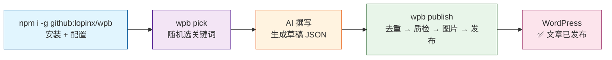
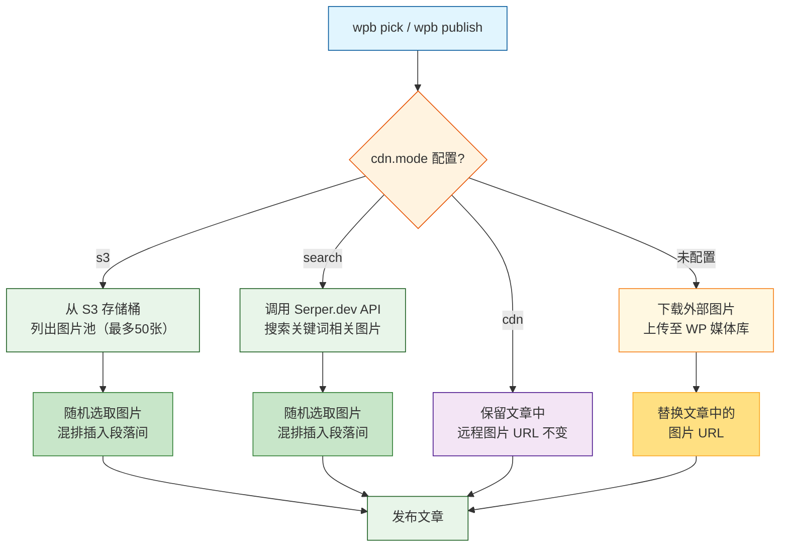
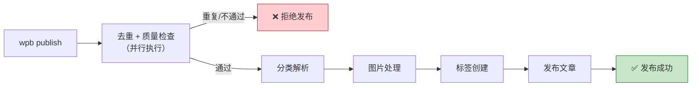

# WordPress AI Publisher (wpb)

> 跨平台 WordPress 发布 CLI — 单命令：随机取关键词 → AI 写文 → 混排图片 → WP REST API 发布

[](https://nodejs.org)
[](LICENSE)
[](#)

---

## 🎯 简介

**wpb** 是一个单文件 Node.js 命令行工具，专为 **AI 辅助的 WordPress 内容发布流程**而设计。它帮助 SEO 运营人员或内容团队从关键词池随机选取主题，结合产品数据和写作指引，辅助 AI 生成文章草稿，再自动完成图片混排、质量检查、去重检测后发布到 WordPress。

**亮点**：

- 兼容 **11 种 AI 工具**（Claude Code、OpenAI Codex、Gemini CLI、Cursor、GitHub Copilot、OpenCode、Hermes、Antigravity CLI、OpenClaw、小U同学、ZCode）
- 支持 **Excel (XLSX/XLS)、CSV、TXT、Google Sheets URL** 等多种数据源
- 完全兼容 **Google Search Console、Bing Webmaster Tools、百度站长平台** 导出的文件
- 四种图片模式：S3 图池混排 / Serper.dev 搜索 / CDN 直链 / 自动上传媒体库
- 发布前自动进行去重检测和质量检查（词数、段落、H3、标题、摘要、标签、失效链接等）

### 核心工作流



---

## 🚀 快速开始

```bash
npm i -g github:lopinx/wpb
```

---

## 💻 CLI 命令

| 命令 | 说明 | 示例 |
|------|------|------|
| `wpb pick` | 随机选取一个关键词 + 输出完整上下文（JSON） | `wpb pick` |
| `wpb fetch <url>` | 拉取已发布文章原文（供改写更新） | `wpb fetch https://example.com/old-post` |
| `wpb publish <file>` | 读取草稿并执行发布（草稿含 postId 时走更新路径） | `wpb publish ~/.wpb/_draft.json` |


### npm scripts

```bash
npm test           # 运行自检测试套件 (263/263 通过)
```

---

## 📋 完整使用步骤

### 第 1 步：安装

```bash
npm i -g github:lopinx/wpb
```

安装后直接运行 `wpb pick`，首次运行时自动完成：
1. **生成默认配置**：创建 `~/.wpb/setting.toml`（可后续手动编辑）
2. **复制数据文件**：将示例关键词、产品、提示词复制到 `~/.wpb/data/`

然后编辑 `~/.wpb/setting.toml`，填入你的 WordPress 站点信息（URL、用户名、Application Password），再次运行 `wpb pick`。

> **可选**：如需为本地已安装的 AI CLI 工具（Claude Code、Gemini CLI 等 11 种）创建命令文件，运行 `wpb install`。该命令在上述基础配置之上额外完成 AI CLI 检测 + 命令文件生成。

> **卸载**：
> ```bash
> npm uninstall -g @lopinx/wpb
> ```
> 如需彻底清理，再手动删除用户数据目录：`rm -rf ~/.wpb`（Windows PowerShell：`Remove-Item -Recurse -Force $HOME\.wpb`）。

### 第 2 步：选取关键词

```bash
wpb pick
```

工具会从 `keywords` 配置的文件中随机选取一行，输出如下 JSON：

```json
{
  "site": {
    "name": "myblog",
    "url": "https://example.com/wp-json/wp/v2",
    "categories": [8603, "Disposable Vape"],
    "images": { "gl": "pl", "hl": "pl", "tbs": "qdr:w" }
  },
  "keyword": "best disposable vape 2024",
  "keywordRow": ["best disposable vape 2024", "12000", "0.45"],
  "products": [["Elf Bar BC5000", "Elf Bar", "5000", "24.99", "5000 puffs disposable vape"]],
  "prompts": "# 写作指令\n\n...",
  "extensions": "# 扩展知识\n\n..."
}
```

将这份 JSON 交给 AI 工具（Claude Code、Gemini CLI 等），让它们基于关键词、产品信息、写作指令和扩展知识撰写文章。

### 第 3 步：起草文章

将 AI 生成的文章保存为草稿 JSON 文件，然后运行发布命令：

```bash
wpb publish <草稿文件路径>
```

草稿格式如下：

```json
{
  "title": "文章标题",
  "excerpt": "文章摘要",
  "content": "<p>第一段...</p><h3>小标题一</h3><p>...</p><h3>小标题二</h3><p>...</p><h3>小标题三</h3><p>...</p>",
  "tags": ["标签1", "标签2", "标签3"]
}
```

**字段说明**：

| 字段 | 类型 | 必填 | 说明 |
|------|------|------|------|
| `title` | string | ✅ | 文章标题（≥10字符） |
| `excerpt` | string | ✅ | 文章摘要（≥50字符） |
| `content` | string | ✅ | HTML 格式的文章正文，需包含 `<p>` 段落和 `<h3>` 小标题 |
| `tags` | string[] | ❌ | 标签数组（3-10个，用于质量检查） |
| `postId` | number | ❌ | 已有文章 ID（更新时必填，由 `wpb fetch` 输出） |
| `site` | string | ❌ | 站点名（多站点更新时必填，由 `wpb fetch` 输出） |

### 第 4 步：发布文章

```bash
wpb publish <草稿文件路径>
```

发布流程自动执行以下步骤：

1. **去重检查 + 质量检查**：并行执行——搜索 WordPress 中是否已有相同标题的文章（重复则拒绝，更新时排除自身），同时验证词数、段落、H3、标题长度、摘要长度、标签数量、失效链接（不通过则拒绝）
2. **分类解析**：将配置的分类（数字 ID 或名称）解析为 WordPress 分类 ID，自动创建不存在的分类
3. **图片处理**：根据配置的 `cdn.mode` 处理图片（见下方「图片模式」一节）
4. **标签创建**：自动在 WordPress 中创建不存在的标签
5. **发布文章**：通过 WordPress REST API 创建已发布状态的文章（草稿含 `postId` 时走更新路径）

### 第 5 步：更新已有文章

当需要改写或优化已发布的站内文章时：

```bash
# 1. 拉取原文（仅接受文章 URL，不接受 ID）
wpb fetch https://example.com/old-post
```

`wpb fetch` 从 URL 的域名自动匹配配置站点（多站点场景下不随机选取），输出包含 `postId`、`site`、`title`、`excerpt`、`content`、`tags`、`categories` 的 JSON。

```bash
# 2. AI 基于原文改写，保存草稿 JSON（保留 postId 和 site 字段）
# 3. 发布（自动检测 postId 走更新路径）
wpb publish <草稿文件路径>
```

> **多站点安全**：更新路径绝不随机选站点。草稿含 `site` 字段时按名称精确匹配配置站点；无 `site` 且单站点配置时回退使用该站点；无 `site` 且多站点配置时拒绝执行并提示先用 `wpb fetch` 获取完整上下文。

---

## 📁 项目文件结构

```
wpb/
├── README.md                          # 项目文档
├── AGENTS.md                          # AI 代理工作指南
├── package.json                       # 项目清单（npm 全局安装入口）
├── skills/
│   └── wpb/
│       ├── SKILL.md                   # AI 工具命令文件模板
│       ├── references/
│       │   └── data/                  # 示例数据文件（安装时复制到 ~/.wpb/data/）
│       │       ├── keywords.csv       # 关键词池
│       │       ├── products.csv       # 产品信息
│       │       ├── prompts.md         # 写作指令
│       │       └── extensions/
│       │           └── wiedza.md      # 扩展知识
│       └── scripts/
│           ├── wpb.mjs                # 核心单文件（所有逻辑，含 initConfig 首次运行初始化）
│           └── __TEST__/
│               └── selftest.mjs       # 自检测试 (223/223 通过)
```

**运行时生成**：

```
~/.wpb/                              # 用户配置目录
├── setting.toml                     # WordPress 配置（npm 安装时自动生成）
└── data/                            # 数据文件（npm 安装时自动复制）
    ├── keywords.csv
    ├── products.csv
    ├── prompts.md
    └── extensions/
        └── wiedza.md
```

---

## 🔧 配置 `~/.wpb/setting.toml`

运行 `npm i -g github:lopinx/wpb` 后自动生成默认配置。使用前请确保满足以下要求：

- Node.js ≥ 18.0
- 一个 WordPress 网站（需要 REST API 访问权限和 Application Password）
- （可选）S3 兼容存储桶，或 Serper.dev API Key

配置文件示例：


```toml
# ~/.wpb/setting.toml
# 每个 [site.<slug>] 代表一个 WordPress 站点
# wpb pick 时会随机选取其中一个站点

[site.myblog]
# ── 站点基本信息（必填）──
name       = "My Blog"                                      # 站点展示名称（可选，留空则用 [site.<slug>] 的 slug 名称）
url        = "https://example.com/wp-json/wp/v2"            # WordPress REST API 地址
user       = "admin"                                        # WordPress 用户名
pass       = "xxxx xxxx xxxx xxxx"                          # WP Application Password（至少10位）
categories = [1, "news", "vape"]                            # 发布分类（数字ID 或 名称字符串，多个用逗号）
keywords   = ["data/keywords.csv"]                          # 关键词文件（可多个，随机合并选取）
products   = "data/products.csv"                            # 产品信息文件（可选，可多个，随机选一个）
prompts    = "data/prompts.md"                              # 写作指令文件（可选，Markdown，可多个，随机选一个）
extensions = ["data/extensions/wiedza.md"]                  # 扩展知识文件（可选，可多个）

# ── 图片处理模式（四选一，见下方详细说明）──
# mode = "s3"      → 从 S3 图池随机选取图片混排（推荐，图片完全可控）
# mode = "search"  → 调用 Serper.dev API 搜索图片并混排
# mode = "cdn"     → 保留文章中的远程图片 URL 不变
# 不配置 [site.myblog.cdn] → 自动下载外部图片上传到 WP 媒体库

[site.myblog.cdn]
mode          = "s3"
bucket        = "my-bucket"                                 # S3 存储桶名称
region        = "us-east-1"                                # AWS 区域，如 us-east-1 / cn-north-1
accessKeyId   = "AKIA..."                                   # S3 Access Key ID
secretAccessKey = "..."                                     # S3 Secret Access Key
prefix        = "images/"                                   # 对象前缀（可选，按目录筛选图片池）
endpoint      = "https://s3.us-east-1.qiniucs.com"          # S3 兼容端点（可选，留空用 AWS 默认）
# 支持：Cloudflare R2 / Amazon S3 / 七牛 Kodo / MinIO / Ceph / 任意 S3 兼容存储
domain        = "cdn.example.com"                           # S3 模式可选，自定义图片 URL 前缀（留空则用 endpoint）

# ── 图片搜索配置（仅在 mode = "search" 时有效）──
[site.myblog.images]
keys       = ["your-serper-dev-api-key-1", "your-key-2"]   # Serper.dev API Key（可多个，随机轮询）
gl         = "pl"                                           # 搜索结果国家代码，默认 "pl"
hl         = "pl"                                           # 搜索结果语言代码，默认 "pl"
tbs        = "qdr:w"                                        # 时间范围过滤，默认过去一周
# 可选值：qdr:d(一天) / qdr:w(一周) / qdr:m(一月) / qdr:y(一年)
query      = ""                                             # 固定搜索词（可选，留空则用文章标题+标签组合搜索）
```

### 配置项完整说明

#### 站点基本信息

| 配置项 | 类型 | 必填 | 说明 |
|--------|------|------|------|
| `name` | string | ❌ | 站点展示名称（可选，留空则用 `[site.<slug>]` 的 slug 名称，仅用于 `pick` 输出标识） |
| `url` | string | ✅ | WordPress REST API 完整地址，必须以 `/wp-json/wp/v2` 结尾 |
| `user` | string | ✅ | WordPress 登录用户名 |
| `pass` | string | ✅ | WP Application Password（WordPress → 用户 → 应用程序密码，至少10位） |
| `categories` | array | ✅ | 发布分类列表，支持数字 ID 或名称字符串，多个用逗号分隔。例：`[1, "news", "vape"]` |
| `keywords` | array | ✅ | 关键词文件路径，支持 CSV/TXT/XLSX/XLS/URL，可配置多个（工具随机合并后选取） |
| `products` | string/array | ❌ | 产品信息文件路径（CSV/TXT/XLSX），用于文章内容补充，可配置多个（随机选一个） |
| `prompts` | string/array | ❌ | 写作指令文件路径（Markdown），定义文章风格和结构要求，可配置多个（随机选一个） |
| `extensions` | array | ❌ | 扩展知识文件路径（可多个），为 AI 提供额外背景知识 |

#### 图片处理配置

| 配置项 | 层级 | 类型 | 必填 | 说明 |
|--------|------|------|------|------|
| `cdn.mode` | `site.<slug>.cdn` | string | ❌ | 图片处理模式：`s3` / `search` / `cdn` / 不配置=媒体库 |
| `cdn.bucket` | `site.<slug>.cdn` | string | s3模式必填 | S3 兼容存储的存储桶名称 |
| `cdn.region` | `site.<slug>.cdn` | string | s3模式必填 | AWS 区域代码，如 `us-east-1`、`eu-west-1`、`cn-north-1` |
| `cdn.accessKeyId` | `site.<slug>.cdn` | string | s3模式必填 | S3 Access Key ID（可由环境变量 `AWS_ACCESS_KEY_ID` 覆盖） |
| `cdn.secretAccessKey` | `site.<slug>.cdn` | string | s3模式必填 | S3 Secret Access Key（可由环境变量 `AWS_SECRET_ACCESS_KEY` 覆盖） |
| `cdn.prefix` | `site.<slug>.cdn` | string | ❌ | S3 对象前缀，用于按目录筛选图片池。例：`"images/blog/"` |
| `cdn.endpoint` | `site.<slug>.cdn` | string | ❌ | S3 兼容端点 URL（留空则使用 AWS 默认端点）。支持 Cloudflare R2、MinIO、七牛 Kodo 等 |
| `cdn.domain` | `site.<slug>.cdn` | string | ❌ | S3 模式自定义图片 URL 前缀（留空则用 endpoint） |
| `images.keys` | `site.<slug>.images` | array | search模式必填 | Serper.dev API Key，支持多个随机轮询以提升配额 |
| `images.gl` | `site.<slug>.images` | string | ❌ | 搜索结果国家代码，默认 `pl` |
| `images.hl` | `site.<slug>.images` | string | ❌ | 搜索结果语言代码，默认 `pl` |
| `images.tbs` | `site.<slug>.images` | string | ❌ | 时间范围过滤，默认 `qdr:w`（过去一周） |
| `images.query` | `site.<slug>.images` | string | ❌ | 固定搜索词（留空则用文章标题 + 标签组合搜索） |

### 多站点支持

在同一 `setting.toml` 中配置多个站点，`wpb pick` 和 `wpb publish` 会随机选取一个：

```toml
[site.blog_pl]
name = "Polish Blog"
url = "https://blog-pl.example.com/wp-json/wp/v2"
# ...

[site.blog_us]
name = "US Blog"
url = "https://blog-us.example.com/wp-json/wp/v2"
# ...
```

### 如何获取 WordPress Application Password

1. 登录 WordPress 后台
2. 进入 **用户 → 个人资料**（或 **Users → Profile**）
3. 滚动到 **应用程序密码**（Application Passwords）区域
4. 输入一个应用名称（如 `wpb-cli`），点击「添加新应用程序密码」
5. 复制生成的密码（格式为 `xxxx xxxx xxxx xxxx`）

---

## 📊 数据文件格式兼容性

wpb 使用 [SheetJS](https://sheetjs.com/) (xlsx 0.20.3) 统一解析所有表格数据，无需为不同格式编写不同逻辑。

### 完全兼容主流 SEO 平台导出格式

| 平台 | CSV (逗号) | CSV (分号) | XLSX | 中文表头 | 说明 |
|------|-----------|-----------|------|---------|------|
| **Google Search Console** | ✅ | ✅ | ✅ | ✅ | 标准导出、带引号/特殊字符、多工作表 XLSX |
| **Bing Webmaster Tools** | ✅ | ✅ | ✅ | ✅ | 欧洲 locale 分号分隔、标准 CSV |
| **百度站长平台** | ✅ | ✅ | ✅ | ✅ | 中文表头、UTF-8/BOM、分号/逗号分隔 |

### 支持的文件格式

| 格式 | 扩展名 | 编码 | 分隔符自动检测 | 备注 |
|------|--------|------|---------------|------|
| CSV | `.csv` | UTF-8 / UTF-8 BOM | 逗号、分号、制表符 | RFC 4180 标准 |
| TXT | `.txt` | UTF-8 / UTF-8 BOM | 制表符、分号、逗号 | 自动检测表头行 |
| Excel | `.xlsx` / `.xls` | 二进制 | N/A (SheetJS 自动) | 多工作表取第一个 |
| URL | `https://...` | HTTP/HTTPS | N/A | 直接读取 Google Sheets 发布链接 |

### 文件内容要求

**关键词文件**（`keywords`）：
- 首行为表头（列名随意），工具取**第一列**作为关键词
- 支持多文件，工具随机合并所有文件后选取
- 空行自动过滤

**产品文件**（`products`）：
- 首行为表头，所有列都会输出到 `pick` 结果供 AI 参考
- 支持配置多个文件（CSV/TXT/XLSX/URL），工具随机选一个文件读取

**写作指令文件**（`prompts`）：
- Markdown 格式，定义文章风格和结构要求
- 支持配置多个文件（本地或 URL），工具随机选一个作为本次写作指令

**配置示例**：

```toml
[site.myblog]
# 单个 CSV 文件
keywords = ["data/keywords.csv"]

# 单个 Excel 文件
keywords = ["data/keywords.xlsx"]

# Google Sheets 发布为 CSV 的 URL
keywords = ["https://docs.google.com/spreadsheets/d/xxx/export?format=csv"]

# 多文件混合（工具随机合并后选取）
keywords = ["data/keywords.csv", "data/keywords.xlsx", "https://docs.google.com/..."]
```

### 边缘情况处理

- 空行自动过滤
- UTF-8 BOM 自动剥离
- 日期格式保持为字符串（防 SheetJS 自动转换）
- 合并单元格取左上角值
- 大数字防科学计数法（`raw: false`）
- 引号/转义/逗号/换行遵循 RFC 4180 标准解析

---

## 🖼️ 图片模式详解

wpb 提供四种图片处理模式，根据 `site.<slug>.cdn.mode` 配置切换：



| 模式 | 配置 | 行为 | 适用场景 |
|------|------|------|----------|
| **S3 兼容** | `mode = "s3"` | 从 S3 存储桶列出图片，随机选取混排插入文章段落间 | 已有图片库，图片质量可控 |
| **图片搜索** | `mode = "search"` + `[images]` | 调用 Serper.dev API 搜索关键词相关图片，随机选取混排 | 无图片库，需要自动配图 |
| **CDN 直传** | `mode = "cdn"` | 保留文章中的远程图片 URL 不变 | 图片已托管在外部 CDN |
| **媒体库** | 不配置 `[site.<slug>.cdn]` | 下载文章中所有外部图片，上传到 WordPress 媒体库并替换 URL | 最简单模式，无需额外配置 |

### S3 模式说明

`mode = "s3"` 时，wpb 会：
1. 使用 S3 SigV4 签名列出存储桶中最多 50 张图片
2. 按 `prefix` 前缀筛选（可选）
3. 过滤图片格式（`.jpg`、`.jpeg`、`.png`、`.gif`、`.webp`、`.avif`）
4. 随机选取图片插入文章段落之间

> S3 密钥支持环境变量覆盖：设置 `AWS_ACCESS_KEY_ID` 和 `AWS_SECRET_ACCESS_KEY` 后，TOML 中的 `accessKeyId`/`secretAccessKey` 会被忽略。
> `endpoint` 留空时自动使用 AWS 默认 S3 地址（`https://<bucket>.s3.<region>.amazonaws.com`）。

### 图片混排规则

图片插入位置由算法自动计算：
- 根据段落数量和图片数量，等间距插入
- 图片包裹在 `<figure>` 标签中，带 `loading="lazy"` 和基础样式
- 若无图片则不插入，不影响文章内容

**插入位置限制**：
- 不得插在首段之前
- 不得插在尾段之后
- 不得插在小标题（`<h3>`）之后相邻位置
- 至少需要 2 个段落才会插入图片

**媒体库上传文件名清理**：

图片上传到 WordPress 媒体库时，文件名会进行清理：
- 保留：ASCII 字母数字、波兰语带附加符号字符（如 `ł`、`ś`、`ź`、`ż`、`ą`、`ę`、`ó`、`ń`）、中日韩字符
- 替换：其他特殊字符替换为短横线 `-`
- 截断：文件名最长 60 字符

---

## ✅ 质检标准

发布前自动执行质量检查，分为**必须通过**和**警告**两类：



### 必须通过（不通过则拒绝发布）

| 指标 | 阈值 | 说明 |
|------|------|------|
| 词数 | ≥ 5000 | 正文纯文本词数（不含 HTML 标签） |
| 段落数 | ≥ 10 | `<p>` 标签数量 |
| H3 标题 | ≥ 3 | `<h3>` 标签数量 |
| 标题长度 | ≥ 10 字符 | 防止过短标题 |
| 摘要长度 | ≥ 50 字符 | 防止过短摘要 |
| 标签数量 | 3-10 个 | 太少或太多都会拒绝 |
| 失效链接 | 0 | 检查前 3 个外链的 HTTP 状态码（GET 请求，仅 4xx 计为失效，5xx 和网络错误不计） |

### 警告（不阻止发布，仅输出提示）

| 指标 | 阈值 | 说明 |
|------|------|------|
| 内链 | ≥ 3 条 | 指向站内产品/服务/文章详情页的链接（导航页 `/category/`、`/tag/` 等及其多层子路径不计入） |
| 关键词命中 | ≥ 2 次 | 每个标签在正文中至少出现 2 次 |
| E-E-A-T 外链 | ≥ 1 | 指向外部权威来源（政府/行业机构/权威媒体）的链接 |

---

## 🔐 安全建议

### 敏感信息不要写入 TOML

`pass`（WordPress 密码）和 S3 密钥是敏感信息，生产环境建议通过环境变量覆盖：

```bash
# macOS / Linux (bash / zsh)
export WP_PASSWORD="your-wordpress-password"
export AWS_ACCESS_KEY_ID="your-aws-access-key"
export AWS_SECRET_ACCESS_KEY="your-aws-secret-key"
```

```powershell
# Windows (PowerShell)
$env:WP_PASSWORD="your-wordpress-password"
$env:AWS_ACCESS_KEY_ID="your-aws-access-key"
$env:AWS_SECRET_ACCESS_KEY="your-aws-secret-key"
```

设置环境变量后，wpb 会优先使用环境变量，TOML 中的值会被忽略。

### Application Password 安全注意事项

- Application Password 具有完整的 WordPress 管理权限，请妥善保管
- 不要将包含密码的配置文件提交到版本控制系统
- 定期轮换 Application Password
- 考虑使用 IP 白名单限制 REST API 访问

---

## 🛠️ 开发

```
skills/wpb/scripts/wpb.mjs         # 核心单文件（所有逻辑在此，含 initConfig 首次运行初始化）
skills/wpb/scripts/__TEST__/selftest.mjs  # 自检测试套件 (223/223 通过)
skills/wpb/SKILL.md                # AI 工具命令文件模板
skills/wpb/references/data/        # 示例数据文件
```

> 无 `postinstall` 钩子。npm 安装时不执行任何脚本，首次运行 `wpb pick` 时自动初始化配置和数据。

```bash
node --check skills/wpb/scripts/wpb.mjs  # 语法检查
npm test                                 # 运行测试
```

### 技术栈

| 组件 | 方案 |
|------|------|
| 语言 | Node.js ES Module (单文件，无构建步骤) |
| 配置 | 自研迷你 TOML 解析器（支持注释、引号、数组、点号键、布尔值、数字） |
| 数据 | SheetJS (xlsx 0.20.3) — 统一解析 CSV/TXT/XLSX/XLS/URL |
| 签名/认证 | S3 SigV4 / WordPress Basic Auth |
| 网络 | 内置指数退避重试（最多 3 次），30 秒超时 |
| 分发 | npm 全局安装（`bin` 字段自动注册 `wpb` 命令） |

---

## 📄 许可

**WTFPL** — Do What The Fuck You Want To Public License
